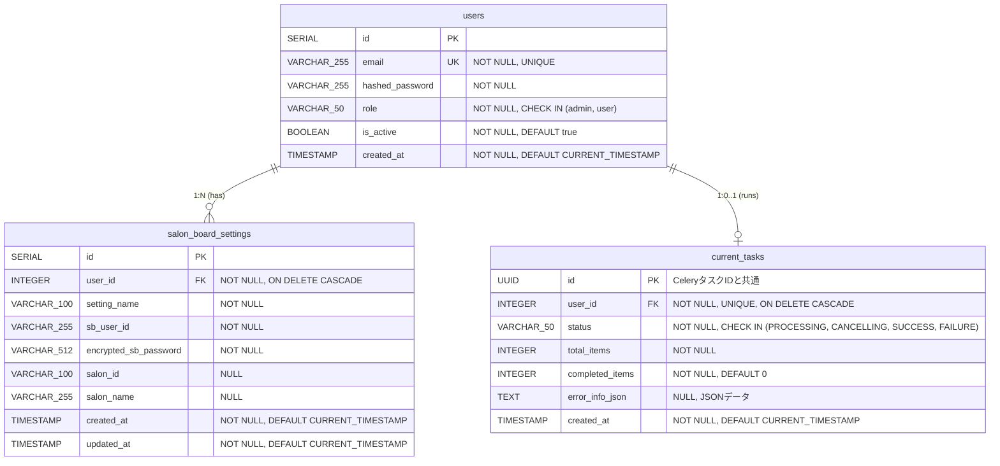

## **SALON BOARDスタイル自動投稿Webアプリケーション 詳細データベース設計書**

### **1. 概要**

#### **1.1. データベース概要**
本システムは、PostgreSQL 15以上を使用し、ユーザー管理、SALON BOARD設定管理、タスク管理の3つの主要ドメインのデータを管理します。

#### **1.2. データベース名**
```
salon_board_db
```

#### **1.3. 文字コード**
```
UTF-8 (UTF8MB4)
```

#### **1.4. タイムゾーン**
```
Asia/Tokyo (JST)
```

#### **1.5. 接続情報**
- **ホスト:** `db`（Docker内部ネットワーク）
- **ポート:** `5432`
- **ユーザー:** `salon_board_user`（環境変数で管理）
- **パスワード:** 環境変数`POSTGRES_PASSWORD`で管理

---

### **2. ER図**



---

### **3. テーブル定義**

#### **3.1. usersテーブル**

**説明:** システム利用者のアカウント情報を格納するマスターテーブル。

**テーブル名:** `users`

**カラム定義:**

| カラム名 | データ型 | NULL | デフォルト値 | 制約 | 説明 |
|:--------|:---------|:-----|:-----------|:-----|:-----|
| id | SERIAL | NOT NULL | auto_increment | PRIMARY KEY | ユーザーID（主キー、自動採番） |
| email | VARCHAR(255) | NOT NULL | - | UNIQUE | メールアドレス（ログインID） |
| hashed_password | VARCHAR(255) | NOT NULL | - | - | bcryptでハッシュ化されたパスワード |
| role | VARCHAR(50) | NOT NULL | - | CHECK (role IN ('admin', 'user')) | ユーザー役割 |
| is_active | BOOLEAN | NOT NULL | true | - | アカウント有効状態 |
| created_at | TIMESTAMP | NOT NULL | CURRENT_TIMESTAMP | - | アカウント作成日時 |

**インデックス:**

| インデックス名 | 種類 | カラム | 説明 |
|:-------------|:-----|:------|:-----|
| users_pkey | PRIMARY KEY | id | 主キー |
| users_email_key | UNIQUE | email | メールアドレス一意制約 |
| idx_users_role | INDEX | role | 役割による検索最適化 |

**制約:**

| 制約名 | 種類 | 内容 |
|:------|:-----|:-----|
| users_pkey | PRIMARY KEY | id |
| users_email_key | UNIQUE | email |
| users_role_check | CHECK | role IN ('admin', 'user') |

**DDL:**
```sql
CREATE TABLE users (
    id SERIAL PRIMARY KEY,
    email VARCHAR(255) NOT NULL UNIQUE,
    hashed_password VARCHAR(255) NOT NULL,
    role VARCHAR(50) NOT NULL CHECK (role IN ('admin', 'user')),
    is_active BOOLEAN NOT NULL DEFAULT true,
    created_at TIMESTAMP NOT NULL DEFAULT CURRENT_TIMESTAMP
);

-- インデックス作成
CREATE INDEX idx_users_role ON users(role);

-- コメント追加
COMMENT ON TABLE users IS 'システム利用者のアカウント情報';
COMMENT ON COLUMN users.id IS 'ユーザーID（主キー）';
COMMENT ON COLUMN users.email IS 'メールアドレス（ログインID）';
COMMENT ON COLUMN users.hashed_password IS 'bcryptハッシュ化パスワード';
COMMENT ON COLUMN users.role IS 'ユーザー役割（admin/user）';
COMMENT ON COLUMN users.is_active IS 'アカウント有効状態（true=有効, false=無効）';
COMMENT ON COLUMN users.created_at IS 'アカウント作成日時';
```

**サンプルデータ:**
```sql
-- 管理者アカウント（初期セットアップスクリプトで作成）
INSERT INTO users (email, hashed_password, role) VALUES
('admin@example.com', '$2b$12$LQv3c1yqBWVHxkd0LHAkCOYz6TtxMQJqhN8/LewY5NU7bl8QkM2/6', 'admin');

-- 一般ユーザー（サンプル）
INSERT INTO users (email, hashed_password, role) VALUES
('user1@example.com', '$2b$12$LQv3c1yqBWVHxkd0LHAkCOYz6TtxMQJqhN8/LewY5NU7bl8QkM2/6', 'user'),
('user2@example.com', '$2b$12$LQv3c1yqBWVHxkd0LHAkCOYz6TtxMQJqhN8/LewY5NU7bl8QkM2/6', 'user');
```

---

#### **3.2. salon_board_settingsテーブル**

**説明:** ユーザーごとのSALON BOARD接続設定を格納するテーブル。パスワードは暗号化して保存。

**テーブル名:** `salon_board_settings`

**カラム定義:**

| カラム名 | データ型 | NULL | デフォルト値 | 制約 | 説明 |
|:--------|:---------|:-----|:-----------|:-----|:-----|
| id | SERIAL | NOT NULL | auto_increment | PRIMARY KEY | 設定ID（主キー、自動採番） |
| user_id | INTEGER | NOT NULL | - | FOREIGN KEY (users.id) ON DELETE CASCADE | 外部キー（ユーザーID） |
| setting_name | VARCHAR(100) | NOT NULL | - | - | 設定名（例：A店、B店） |
| sb_user_id | VARCHAR(255) | NOT NULL | - | - | SALON BOARDログインID |
| encrypted_sb_password | VARCHAR(512) | NOT NULL | - | - | Fernetで暗号化されたパスワード |
| salon_id | VARCHAR(100) | NULL | - | - | サロンID（複数店舗アカウント用、任意） |
| salon_name | VARCHAR(255) | NULL | - | - | サロン名（複数店舗アカウント用、任意） |
| created_at | TIMESTAMP | NOT NULL | CURRENT_TIMESTAMP | - | 設定作成日時 |
| updated_at | TIMESTAMP | NOT NULL | CURRENT_TIMESTAMP | - | 設定更新日時 |

**インデックス:**

| インデックス名 | 種類 | カラム | 説明 |
|:-------------|:-----|:------|:-----|
| salon_board_settings_pkey | PRIMARY KEY | id | 主キー |
| idx_sb_settings_user_id | INDEX | user_id | ユーザーIDによる検索最適化 |
| idx_sb_settings_user_setting | INDEX | (user_id, setting_name) | ユーザー内の設定名検索最適化 |

**制約:**

| 制約名 | 種類 | 内容 |
|:------|:-----|:-----|
| salon_board_settings_pkey | PRIMARY KEY | id |
| salon_board_settings_user_id_fkey | FOREIGN KEY | user_id REFERENCES users(id) ON DELETE CASCADE |

**DDL:**
```sql
CREATE TABLE salon_board_settings (
    id SERIAL PRIMARY KEY,
    user_id INTEGER NOT NULL REFERENCES users(id) ON DELETE CASCADE,
    setting_name VARCHAR(100) NOT NULL,
    sb_user_id VARCHAR(255) NOT NULL,
    encrypted_sb_password VARCHAR(512) NOT NULL,
    salon_id VARCHAR(100),
    salon_name VARCHAR(255),
    created_at TIMESTAMP NOT NULL DEFAULT CURRENT_TIMESTAMP,
    updated_at TIMESTAMP NOT NULL DEFAULT CURRENT_TIMESTAMP
);

-- インデックス作成
CREATE INDEX idx_sb_settings_user_id ON salon_board_settings(user_id);
CREATE INDEX idx_sb_settings_user_setting ON salon_board_settings(user_id, setting_name);

-- コメント追加
COMMENT ON TABLE salon_board_settings IS 'SALON BOARD接続設定';
COMMENT ON COLUMN salon_board_settings.id IS '設定ID（主キー）';
COMMENT ON COLUMN salon_board_settings.user_id IS '外部キー（ユーザーID）';
COMMENT ON COLUMN salon_board_settings.setting_name IS '設定名';
COMMENT ON COLUMN salon_board_settings.sb_user_id IS 'SALON BOARDログインID';
COMMENT ON COLUMN salon_board_settings.encrypted_sb_password IS 'Fernet暗号化パスワード';
COMMENT ON COLUMN salon_board_settings.salon_id IS 'サロンID（複数店舗用）';
COMMENT ON COLUMN salon_board_settings.salon_name IS 'サロン名（複数店舗用）';
COMMENT ON COLUMN salon_board_settings.created_at IS '設定作成日時';
COMMENT ON COLUMN salon_board_settings.updated_at IS '設定更新日時';
```

**トリガー（updated_at自動更新）:**
```sql
-- updated_at自動更新用関数
CREATE OR REPLACE FUNCTION update_updated_at_column()
RETURNS TRIGGER AS $$
BEGIN
    NEW.updated_at = CURRENT_TIMESTAMP;
    RETURN NEW;
END;
$$ language 'plpgsql';

-- トリガー設定
CREATE TRIGGER update_salon_board_settings_updated_at
    BEFORE UPDATE ON salon_board_settings
    FOR EACH ROW
    EXECUTE FUNCTION update_updated_at_column();
```

**サンプルデータ:**
```sql
-- user_id=2のユーザーの設定（サンプル）
INSERT INTO salon_board_settings (user_id, setting_name, sb_user_id, encrypted_sb_password, salon_id, salon_name) VALUES
(2, 'A店', 'salon_a@example.com', 'gAAAAABl...encrypted...data...', '12345', 'サロンA 高崎店'),
(2, 'B店', 'salon_b@example.com', 'gAAAAABl...encrypted...data...', NULL, NULL);
```

---

#### **3.3. current_tasksテーブル**

**説明:** 現在実行中のタスク状態を管理するテーブル。user_idにUNIQUE制約を設定し、ユーザー単位のシングルタスク実行を保証。

**テーブル名:** `current_tasks`

**カラム定義:**

| カラム名 | データ型 | NULL | デフォルト値 | 制約 | 説明 |
|:--------|:---------|:-----|:-----------|:-----|:-----|
| id | UUID | NOT NULL | - | PRIMARY KEY | タスクID（CeleryタスクIDと共通） |
| user_id | INTEGER | NOT NULL | - | FOREIGN KEY (users.id) ON DELETE CASCADE, UNIQUE | 外部キー（ユーザーID）、一意制約 |
| status | VARCHAR(50) | NOT NULL | - | CHECK (status IN ('PROCESSING', 'CANCELLING', 'SUCCESS', 'FAILURE')) | タスク状態 |
| total_items | INTEGER | NOT NULL | - | CHECK (total_items >= 0) | 処理対象の総スタイル数 |
| completed_items | INTEGER | NOT NULL | 0 | CHECK (completed_items >= 0) | 処理完了したスタイル数 |
| error_info_json | TEXT | NULL | - | - | エラー情報のJSON文字列 |
| created_at | TIMESTAMP | NOT NULL | CURRENT_TIMESTAMP | - | タスク作成日時 |

**インデックス:**

| インデックス名 | 種類 | カラム | 説明 |
|:-------------|:-----|:------|:-----|
| current_tasks_pkey | PRIMARY KEY | id | 主キー |
| current_tasks_user_id_key | UNIQUE | user_id | ユーザー単位のシングルタスク保証 |
| idx_current_tasks_status | INDEX | status | ステータスによる検索最適化 |

**制約:**

| 制約名 | 種類 | 内容 |
|:------|:-----|:-----|
| current_tasks_pkey | PRIMARY KEY | id |
| current_tasks_user_id_key | UNIQUE | user_id（シングルタスク保証の要） |
| current_tasks_user_id_fkey | FOREIGN KEY | user_id REFERENCES users(id) ON DELETE CASCADE |
| current_tasks_status_check | CHECK | status IN ('PROCESSING', 'CANCELLING', 'SUCCESS', 'FAILURE') |
| current_tasks_total_items_check | CHECK | total_items >= 0 |
| current_tasks_completed_items_check | CHECK | completed_items >= 0 |

**DDL:**
```sql
-- UUID拡張機能の有効化
CREATE EXTENSION IF NOT EXISTS "uuid-ossp";

CREATE TABLE current_tasks (
    id UUID PRIMARY KEY,
    user_id INTEGER NOT NULL UNIQUE REFERENCES users(id) ON DELETE CASCADE,
    status VARCHAR(50) NOT NULL CHECK (status IN ('PROCESSING', 'CANCELLING', 'SUCCESS', 'FAILURE')),
    total_items INTEGER NOT NULL CHECK (total_items >= 0),
    completed_items INTEGER NOT NULL DEFAULT 0 CHECK (completed_items >= 0),
    error_info_json TEXT,
    created_at TIMESTAMP NOT NULL DEFAULT CURRENT_TIMESTAMP
);

-- インデックス作成
CREATE INDEX idx_current_tasks_status ON current_tasks(status);

-- コメント追加
COMMENT ON TABLE current_tasks IS '現在実行中のタスク情報';
COMMENT ON COLUMN current_tasks.id IS 'タスクID（UUID、CeleryタスクIDと共通）';
COMMENT ON COLUMN current_tasks.user_id IS '外部キー（ユーザーID）、UNIQUE制約でシングルタスク保証';
COMMENT ON COLUMN current_tasks.status IS 'タスク状態（PROCESSING/CANCELLING/SUCCESS/FAILURE）';
COMMENT ON COLUMN current_tasks.total_items IS '処理対象の総スタイル数';
COMMENT ON COLUMN current_tasks.completed_items IS '処理完了したスタイル数';
COMMENT ON COLUMN current_tasks.error_info_json IS 'エラー情報のJSON文字列';
COMMENT ON COLUMN current_tasks.created_at IS 'タスク作成日時';
```

**サンプルデータ:**
```sql
-- 実行中タスク（サンプル）
INSERT INTO current_tasks (id, user_id, status, total_items, completed_items, error_info_json) VALUES
('a1b2c3d4-e5f6-7890-abcd-ef1234567890', 2, 'PROCESSING', 20, 5, NULL);

-- エラーありの完了タスク（サンプル）
INSERT INTO current_tasks (id, user_id, status, total_items, completed_items, error_info_json) VALUES
('b2c3d4e5-f6a7-8901-bcde-f12345678901', 3, 'FAILURE', 10, 8,
'[{"row_number": 3, "style_name": "大人かわいいボブ", "field": "クーポン名", "reason": "指定されたクーポン名が見つかりませんでした", "screenshot_path": "/static/screenshots/error-001.png"}]');
```

---

### **4. データ型詳細仕様**

#### **4.1. SERIAL型**
- PostgreSQLの自動採番型
- 内部的には`INTEGER`と`SEQUENCE`の組み合わせ
- 範囲: 1 ~ 2,147,483,647

#### **4.2. VARCHAR型**
- 可変長文字列
- 指定した最大長まで格納可能
- UTF-8エンコーディング

#### **4.3. TEXT型**
- 無制限長の文字列
- JSONデータの格納に使用（`error_info_json`）

#### **4.4. UUID型**
- 128ビットの一意識別子
- CeleryタスクIDとの整合性のため使用
- 拡張機能`uuid-ossp`が必要

#### **4.5. TIMESTAMP型**
- 日付と時刻を格納
- タイムゾーンなし（アプリケーション層でUTC管理）
- 範囲: 4713 BC ~ 294276 AD

---

### **5. インデックス戦略**

#### **5.1. 主キーインデックス**
全テーブルの`id`カラムに自動作成されるB-treeインデックス。

#### **5.2. 一意制約インデックス**
- `users.email`: ログイン時の高速検索
- `current_tasks.user_id`: シングルタスク制御とユーザー検索

#### **5.3. 外部キーインデックス**
- `salon_board_settings.user_id`: ユーザーの設定一覧取得時の最適化
- `current_tasks.user_id`: ユーザーのタスク状態取得時の最適化

#### **5.4. 検索最適化インデックス**
- `users.role`: 管理者一覧、一般ユーザー一覧の絞り込み
- `current_tasks.status`: タスク状態による検索
- `salon_board_settings(user_id, setting_name)`: 複合インデックスで設定名検索を最適化

---

### **6. 外部キー制約とカスケード動作**

#### **6.1. salon_board_settings.user_id**
```sql
FOREIGN KEY (user_id) REFERENCES users(id) ON DELETE CASCADE
```
- **動作:** ユーザーが削除されると、そのユーザーの全SALON BOARD設定も自動削除
- **理由:** ユーザーが存在しない設定は無意味なため

#### **6.2. current_tasks.user_id**
```sql
FOREIGN KEY (user_id) REFERENCES users(id) ON DELETE CASCADE
```
- **動作:** ユーザーが削除されると、そのユーザーの実行中タスクも自動削除
- **理由:** ユーザーが存在しないタスクは無意味なため

---

### **7. CHECK制約詳細**

#### **7.1. users.role**
```sql
CHECK (role IN ('admin', 'user'))
```
想定外の役割値を防止。

#### **7.2. current_tasks.status**
```sql
CHECK (status IN ('PROCESSING', 'CANCELLING', 'SUCCESS', 'FAILURE'))
```
タスク状態の整合性を保証。

#### **7.3. current_tasks.total_items / completed_items**
```sql
CHECK (total_items >= 0)
CHECK (completed_items >= 0)
```
負数の防止。

---

### **8. JSON構造定義**

#### **8.1. current_tasks.error_info_json**

**説明:** タスク実行中に発生したエラー情報を格納するJSON配列。

**スキーマ:**
```json
[
  {
    "row_number": integer,
    "style_name": string,
    "field": string,
    "reason": string,
    "screenshot_path": string
  }
]
```

**フィールド説明:**

| フィールド名 | 型 | 説明 |
|:-----------|:---|:-----|
| row_number | integer | CSVファイルの行番号 |
| style_name | string | スタイル名 |
| field | string | エラーが発生したフィールド名 |
| reason | string | エラー原因の詳細説明 |
| screenshot_path | string | エラー発生時のスクリーンショット画像パス |

**サンプル:**
```json
[
  {
    "row_number": 3,
    "style_name": "大人かわいいボブ",
    "field": "クーポン名",
    "reason": "指定されたクーポン名「カット＋カラー特別割引」が見つかりませんでした",
    "screenshot_path": "/static/screenshots/error-20250120-140530-001.png"
  },
  {
    "row_number": 7,
    "style_name": "無造作ツイストパーマ",
    "field": "スタイリスト名",
    "reason": "指定されたスタイリスト名「佐藤 太郎」が見つかりませんでした",
    "screenshot_path": "/static/screenshots/error-20250120-140615-002.png"
  }
]
```

---

### **9. セキュリティ考慮事項**

#### **9.1. パスワードのハッシュ化**
- **対象:** `users.hashed_password`
- **アルゴリズム:** bcrypt
- **ライブラリ:** `passlib[bcrypt]`
- **ソルトラウンド:** 12
- **サンプルハッシュ:** `$2b$12$LQv3c1yqBWVHxkd0LHAkCOYz6TtxMQJqhN8/LewY5NU7bl8QkM2/6`

#### **9.2. SALON BOARDパスワードの暗号化**
- **対象:** `salon_board_settings.encrypted_sb_password`
- **アルゴリズム:** Fernet（対称鍵暗号）
- **ライブラリ:** `cryptography.fernet`
- **キー管理:** 環境変数`ENCRYPTION_KEY`で32バイトキーを管理
- **サンプル暗号文:** `gAAAAABl...（Base64エンコードされた暗号データ）`

**暗号化例（Python）:**
```python
from cryptography.fernet import Fernet
import os

# 環境変数からキー取得
key = os.getenv("ENCRYPTION_KEY").encode()
cipher = Fernet(key)

# パスワード暗号化
password = "myPassword123!"
encrypted = cipher.encrypt(password.encode())
print(encrypted.decode())  # DB保存用文字列

# 復号化
decrypted = cipher.decrypt(encrypted)
print(decrypted.decode())  # 元のパスワード
```

#### **9.3. SQLインジェクション対策**
- SQLAlchemy ORMを使用し、プリペアドステートメントで自動対策
- 生SQLを使用する場合は、必ずパラメータバインディングを使用

---

### **10. バックアップ戦略**

#### **10.1. フルバックアップ**
- **頻度:** 毎日午前3時（JST）
- **保持期間:** 30日間
- **コマンド:**
```bash
pg_dump -U salon_board_user -F c -b -v -f backup_$(date +%Y%m%d).dump salon_board_db
```

#### **10.2. トランザクションログバックアップ**
- **頻度:** 1時間ごと
- **保持期間:** 7日間
- **目的:** ポイントインタイムリカバリ（PITR）

#### **10.3. リストア手順**
```bash
# データベース削除（注意）
dropdb -U salon_board_user salon_board_db

# データベース再作成
createdb -U salon_board_user salon_board_db

# バックアップからリストア
pg_restore -U salon_board_user -d salon_board_db -v backup_20250120.dump
```

---

### **11. パフォーマンス最適化**

#### **11.1. 接続プール設定**
- **最大接続数:** 20
- **最小接続数:** 5
- **アイドルタイムアウト:** 300秒
- **SQLAlchemy設定例:**
```python
from sqlalchemy import create_engine

engine = create_engine(
    "postgresql://salon_board_user:password@db:5432/salon_board_db",
    pool_size=5,
    max_overflow=15,
    pool_timeout=30,
    pool_recycle=3600
)
```

#### **11.2. クエリ最適化**
- **N+1問題対策:** SQLAlchemyの`joinedload`、`selectinload`を使用
- **ページネーション:** `LIMIT`と`OFFSET`で大量データを分割取得
- **インデックス活用:** `EXPLAIN ANALYZE`で実行計画を確認

#### **11.3. 定期メンテナンス**
```sql
-- 統計情報更新
ANALYZE;

-- 不要な領域回収
VACUUM;

-- フル VACUUM（月次）
VACUUM FULL;
```

---

### **12. マイグレーション管理**

#### **12.1. マイグレーションツール**
Alembicを使用してデータベーススキーマのバージョン管理を行います。

#### **12.2. 初回マイグレーション**
```bash
# Alembic初期化
alembic init alembic

# 初回マイグレーションファイル生成
alembic revision --autogenerate -m "Initial migration"

# マイグレーション実行
alembic upgrade head
```

#### **12.3. マイグレーション例（カラム追加）**
```python
# alembic/versions/xxxx_add_column.py
def upgrade():
    op.add_column('users', sa.Column('last_login', sa.TIMESTAMP(), nullable=True))

def downgrade():
    op.drop_column('users', 'last_login')
```

---

### **13. モニタリングとロギング**

#### **13.1. スロークエリログ**
```sql
-- postgresql.confで設定
log_min_duration_statement = 1000  # 1秒以上のクエリをログ
```

#### **13.2. 接続数監視**
```sql
-- 現在の接続数確認
SELECT count(*) FROM pg_stat_activity WHERE datname = 'salon_board_db';

-- 接続詳細確認
SELECT pid, usename, application_name, state, query
FROM pg_stat_activity
WHERE datname = 'salon_board_db';
```

#### **13.3. テーブルサイズ監視**
```sql
-- テーブルサイズ確認
SELECT
    tablename,
    pg_size_pretty(pg_total_relation_size(schemaname||'.'||tablename)) AS size
FROM pg_tables
WHERE schemaname = 'public'
ORDER BY pg_total_relation_size(schemaname||'.'||tablename) DESC;
```

---

### **14. データ保持ポリシー**

#### **14.1. current_tasksテーブル**
- **保持期間:** 完了後48時間
- **削除方法:** ユーザーが確認後、APIで削除（`DELETE /api/v1/tasks/finished-task`）
- **自動クリーンアップ:** 毎日午前4時に48時間以上経過した完了タスクを自動削除

**自動クリーンアップSQLサンプル:**
```sql
-- 48時間以上前に完了したタスクを削除
DELETE FROM current_tasks
WHERE status IN ('SUCCESS', 'FAILURE')
AND created_at < NOW() - INTERVAL '48 hours';
```

#### **14.2. usersテーブル**
- **保持期間:** 無期限（明示的に削除されるまで）
- **削除方法:** 管理者による手動削除

#### **14.3. salon_board_settingsテーブル**
- **保持期間:** 無期限（明示的に削除されるまで）
- **削除方法:** ユーザーまたは管理者による削除

---

### **15. 初期データ投入スクリプト**

#### **15.1. 初回管理者作成**
```python
# scripts/create_admin.py
import sys
import argparse
from sqlalchemy.orm import Session
from app.db.session import engine
from app.models.user import User
from app.core.security import get_password_hash

def create_admin(email: str, password: str):
    with Session(engine) as session:
        # 既存チェック
        existing = session.query(User).filter(User.email == email).first()
        if existing:
            print(f"Error: User with email {email} already exists.")
            sys.exit(1)

        # 管理者作成
        admin = User(
            email=email,
            hashed_password=get_password_hash(password),
            role="admin"
        )
        session.add(admin)
        session.commit()
        print(f"Admin user created successfully: {email}")

if __name__ == "__main__":
    parser = argparse.ArgumentParser()
    parser.add_argument("--email", required=True)
    parser.add_argument("--password", required=True)
    args = parser.parse_args()

    create_admin(args.email, args.password)
```

**実行例:**
```bash
docker-compose exec web python -m scripts.create_admin \
  --email admin@example.com \
  --password "SecureAdminPassword123!"
```

---

### **16. テスト用データ投入**

```sql
-- テスト用管理者
INSERT INTO users (email, hashed_password, role) VALUES
('test_admin@example.com', '$2b$12$LQv3c1yqBWVHxkd0LHAkCOYz6TtxMQJqhN8/LewY5NU7bl8QkM2/6', 'admin');

-- テスト用一般ユーザー
INSERT INTO users (email, hashed_password, role) VALUES
('test_user1@example.com', '$2b$12$LQv3c1yqBWVHxkd0LHAkCOYz6TtxMQJqhN8/LewY5NU7bl8QkM2/6', 'user'),
('test_user2@example.com', '$2b$12$LQv3c1yqBWVHxkd0LHAkCOYz6TtxMQJqhN8/LewY5NU7bl8QkM2/6', 'user');

-- テスト用SALON BOARD設定（user_id=2用）
INSERT INTO salon_board_settings (user_id, setting_name, sb_user_id, encrypted_sb_password) VALUES
(2, 'テスト店A', 'test_salon_a@example.com', 'gAAAAABl...encrypted...'),
(2, 'テスト店B', 'test_salon_b@example.com', 'gAAAAABl...encrypted...');
```

---

### **17. データベース設計原則**

#### **17.1. 正規化**
- 第3正規形（3NF）を基本とする
- パフォーマンス上必要な場合のみ非正規化を検討

#### **17.2. 命名規則**
- **テーブル名:** 複数形、小文字、アンダースコア区切り（例：`salon_board_settings`）
- **カラム名:** 単数形、小文字、アンダースコア区切り（例：`user_id`）
- **インデックス名:** `idx_<テーブル名>_<カラム名>`（例：`idx_users_role`）
- **外部キー制約名:** `<テーブル名>_<カラム名>_fkey`（例：`salon_board_settings_user_id_fkey`）

#### **17.3. NULL許可基準**
- **NOT NULL:** 必須項目、業務上必ず値が存在するもの
- **NULL:** 任意項目、後から追加される可能性があるもの

---

### **18. トラブルシューティング**

#### **18.1. 接続エラー**
```bash
# PostgreSQLコンテナの状態確認
docker-compose ps db

# ログ確認
docker-compose logs db

# 接続テスト
docker-compose exec web psql -U salon_board_user -d salon_board_db -c "SELECT 1;"
```

#### **18.2. デッドロック**
```sql
-- デッドロック情報確認
SELECT * FROM pg_stat_activity WHERE wait_event_type = 'Lock';

-- 長時間実行中のクエリ確認
SELECT pid, now() - pg_stat_activity.query_start AS duration, query
FROM pg_stat_activity
WHERE state = 'active'
ORDER BY duration DESC;

-- 必要に応じてクエリ強制終了
SELECT pg_terminate_backend(pid);
```

#### **18.3. ディスク容量不足**
```sql
-- データベースサイズ確認
SELECT pg_size_pretty(pg_database_size('salon_board_db'));

-- 不要データ削除
VACUUM FULL;
```

---

### **19. 変更履歴**

| バージョン | 日付 | 変更内容 | 変更者 |
|:---------|:-----|:---------|:------|
| 1.0 | 2025-01-20 | 初版作成 | 開発チーム |

---

**文書作成日:** 2025年1月20日
**作成者:** データベース設計担当
**承認者:** プロジェクトマネージャー
