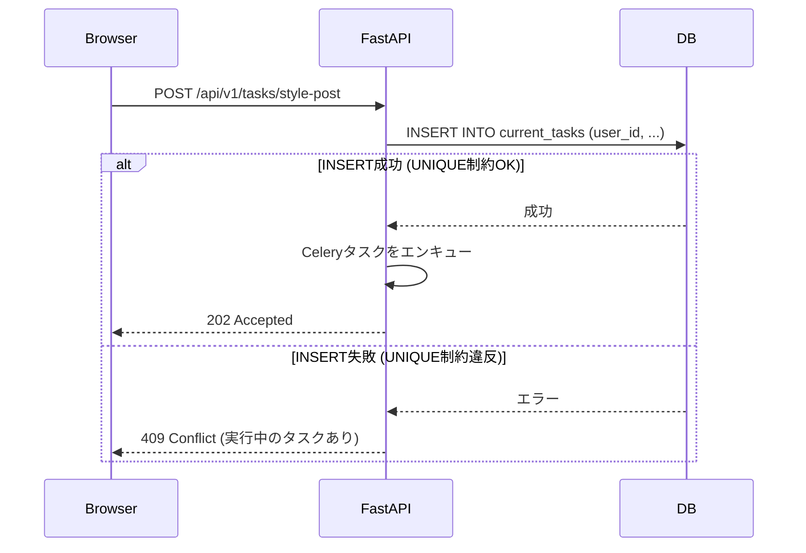
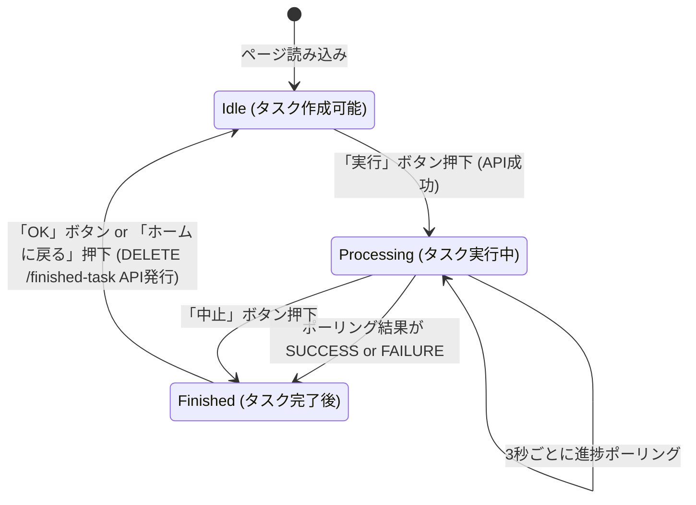

## **SALON BOARDスタイル自動投稿Webアプリケーション 詳細設計書**

### **1. システムアーキテクチャ**

#### **1.1. 概要**
本システムは、Docker Composeを用いて構築された複数のコンテナが連携して動作するマイクロサービスアーキテクチャを採用する。これにより、各機能の独立性を高め、開発、デプロイ、メンテナンスの効率を向上させる。

#### **1.2. コンテナ構成**

```mermaid
graph TD
    subgraph "外部ネットワーク"
        User[ユーザーのブラウザ]
    end

    subgraph "サーバー (VPS)"
        Nginx[<b>Nginx</b><br>リバースプロキシ<br>SSL/TLS終端処理<br>静的ファイル配信]

        subgraph "アプリケーションサービス"
            WebApp[<b>Webコンテナ (FastAPI)</b><br>・APIエンドポイント提供<br>・UI描画 (Jinja2)<br>・認証処理<br>・タスクの受付とキューイング]
            Worker[<b>Workerコンテナ (Celery)</b><br>・非同期タスク実行<br>・Playwrightによるブラウザ自動化]
        end

        subgraph "データストアサービス"
            DB[(<b>PostgreSQL</b><br>ユーザー情報<br>SB設定<br>実行中タスク情報)]
            Queue[(<b>Redis</b><br>Celeryタスクキュー<br>結果バックエンド)]
        end

        subgraph "永続化ボリューム"
            PostgresData[PostgreSQL Data Volume]
            AppLogs[Application Log Volume]
        end
    end

    User -- HTTPS (443) --> Nginx
    Nginx -- HTTP --> WebApp

    WebApp -- タスクをエンキュー --> Queue
    WebApp -- データ読み書き --> DB

    Worker -- タスクをデキュー --> Queue
    Worker -- 進捗/結果を更新 --> DB

    DB -- データ永続化 --> PostgresData
    WebApp -- ログ出力 --> AppLogs
    Worker -- ログ出力 --> AppLogs
```

#### **1.3. 技術スタック**

| 領域 | 技術/ライブラリ | 選定理由 |
| :--- | :--- | :--- |
| **バックエンド** | Python 3.11+, FastAPI, Uvicorn | 高速なAPI開発と非同期処理に最適。 |
| **フロントエンド** | Jinja2, HTML5, CSS3, JavaScript | FastAPIとの親和性が高く、シンプルなSSRでモバイルファーストUIを構築。 |
| **ブラウザ自動化** | Playwright for Python | 安定性と高機能性を両立。モダンなWebサイトの自動化に強い。 |
| **データベース** | PostgreSQL 15+ | 信頼性と拡張性に優れたRDBMS。 |
| **タスクキュー** | Celery, Redis | Pythonにおける非同期タスク処理のデファクトスタンダード。Redisは高速なインメモリブローカーとして最適。 |
| **データ検証** | Pydantic | FastAPIに組み込まれており、リクエスト/レスポンスの型チェックとバリデーションを強力にサポート。 |
| **認証** | JWT (JSON Web Tokens), `python-jose` | ステートレスな認証を実現し、APIの拡張性を高める。 |
| **セキュリティ** | `passlib[bcrypt]`, `cryptography` | パスワードのハッシュ化と機密情報の暗号化を安全に実装。 |
| **コンテナ** | Docker, Docker Compose | 環境差異をなくし、ポータビリティと再現性を確保。 |

#### **1.4. ディレクトリ構造（案）**
```
.
├── app/                  # FastAPI/Celeryアプリケーションのソースコード
│   ├── api/              # APIエンドポイントのルーター
│   │   ├── v1/
│   │   │   ├── endpoints/
│   │   │   │   ├── auth.py
│   │   │   │   ├── tasks.py
│   │   │   │   └── users.py
│   │   │   └── api.py
│   ├── core/             # 設定、セキュリティなどのコア機能
│   │   ├── config.py     # 環境変数読み込み
│   │   └── security.py   # パスワード処理、暗号化、JWT
│   ├── crud/             # データベース操作（CRUD）
│   ├── db/               # データベースセッション管理
│   ├── models/           # SQLAlchemyのモデル（テーブル定義）
│   ├── schemas/          # Pydanticのスキーマ（データ検証）
│   ├── services/         # Playwrightの実行ロジック
│   │   └── style_poster.py
│   ├── static/           # CSS, JS, 画像ファイル
│   ├── templates/        # Jinja2テンプレート
│   ├── worker.py         # Celeryワーカーのエントリーポイント
│   └── main.py           # FastAPIアプリケーションのエントリーポイント
├── scripts/              # 運用スクリプト
│   └── create_admin.py   # 初回管理者作成スクリプト
├── .env                  # 環境変数ファイル（Git管理外）
├── .gitignore
├── Dockerfile            # Web/Worker共通のDockerfile
├── docker-compose.yml
└── README.md
```

---

### **2. データベース設計**

#### **2.1. ER図**

```mermaid
erDiagram
    users {
        SERIAL id PK
        VARCHAR(255) email UK "ログインID"
        VARCHAR(255) hashed_password
        VARCHAR(50) role " 'admin' or 'user' "
        TIMESTAMP created_at
    }

    salon_board_settings {
        SERIAL id PK
        INTEGER user_id FK
        VARCHAR(100) setting_name "設定名（例：A店）"
        VARCHAR(255) sb_user_id "SBログインID"
        VARCHAR(512) encrypted_sb_password "暗号化されたSBパスワード"
        VARCHAR(100) salon_id NULL "対象サロンID"
        VARCHAR(255) salon_name NULL "対象サロン名"
        TIMESTAMP created_at
        TIMESTAMP updated_at
    }

    current_tasks {
        UUID id PK "CeleryのタスクIDと共通"
        INTEGER user_id FK
        VARCHAR(50) status "PROCESSING, CANCELLING, SUCCESS, FAILURE"
        INTEGER total_items
        INTEGER completed_items
        TEXT error_info_json NULL "エラー情報のJSON文字列"
        TIMESTAMP created_at
    }

    users ||--o{ salon_board_settings : "has"
    users |o--|| current_tasks : "runs"
```

#### **2.2. テーブルスキーマ定義**

**1. `users` テーブル**
*   **説明**: システム利用者のアカウント情報を格納する。

| カラム名 | データ型 | 制約 | 説明 |
| :--- | :--- | :--- | :--- |
| `id` | SERIAL | PRIMARY KEY | 主キー（自動採番） |
| `email` | VARCHAR(255) | UNIQUE, NOT NULL | ログインIDとして使用するメールアドレス |
| `hashed_password` | VARCHAR(255) | NOT NULL | `bcrypt`でハッシュ化されたパスワード |
| `role` | VARCHAR(50) | NOT NULL, CHECK(`role` IN ('admin', 'user')) | ユーザー役割 (`admin` or `user`) |
| `created_at` | TIMESTAMP | NOT NULL, DEFAULT CURRENT_TIMESTAMP | 作成日時 |

**2. `salon_board_settings` テーブル**
*   **説明**: ユーザーごとにSALON BOARDの接続情報を格納する。

| カラム名 | データ型 | 制約 | 説明 |
| :--- | :--- | :--- | :--- |
| `id` | SERIAL | PRIMARY KEY | 主キー（自動採番） |
| `user_id` | INTEGER | NOT NULL, FOREIGN KEY (`users.id`) ON DELETE CASCADE | 外部キー（ユーザーが削除されたら設定も削除） |
| `setting_name` | VARCHAR(100) | NOT NULL | ユーザーが識別するための設定名 |
| `sb_user_id` | VARCHAR(255) | NOT NULL | SALON BOARDのログインID |
| `encrypted_sb_password`| VARCHAR(512) | NOT NULL | `cryptography`の`Fernet`で暗号化されたパスワード |
| `salon_id` | VARCHAR(100) | | 対象サロンID（任意） |
| `salon_name` | VARCHAR(255) | | 対象サロン名（任意） |
| `created_at` | TIMESTAMP | NOT NULL, DEFAULT CURRENT_TIMESTAMP | 作成日時 |
| `updated_at` | TIMESTAMP | NOT NULL, DEFAULT CURRENT_TIMESTAMP | 更新日時 |

**3. `current_tasks` テーブル**
*   **説明**: **現在実行中**のタスク状態を管理する。`user_id`にUNIQUE制約をかけることで、ユーザー単位のシングルタスク実行をDBレベルで保証する。

| カラム名 | データ型 | 制約 | 説明 |
| :--- | :--- | :--- | :--- |
| `id` | UUID | PRIMARY KEY | 主キー（CeleryのタスクIDと共通） |
| `user_id` | INTEGER | UNIQUE, NOT NULL, FOREIGN KEY (`users.id`) ON DELETE CASCADE | 外部キー。**UNIQUE制約が同時実行制限の要**。 |
| `status` | VARCHAR(50) | NOT NULL | タスク状態 (`PROCESSING`, `CANCELLING`, `SUCCESS`, `FAILURE`) |
| `total_items` | INTEGER | NOT NULL | 処理対象の総スタイル数 |
| `completed_items` | INTEGER | NOT NULL, DEFAULT 0 | 処理完了したスタイル数 |
| `error_info_json` | TEXT | | エラー情報のリストをJSON形式で保存 |
| `created_at` | TIMESTAMP | NOT NULL, DEFAULT CURRENT_TIMESTAMP | 作成日時 |

---

### **3. API設計 (RESTful API)**

*   **ベースURL**: `/api/v1`
*   **認証**: JWT Bearer Token (`Authorization: Bearer <token>`) を使用。

#### **3.1. 認証 (`/auth`)**
*   **POST `/token`**: ログインしてJWTを取得する。
    *   **リクエスト (Pydanticモデル: `TokenRequestForm`)**: `application/x-www-form-urlencoded`
        *   `username` (str): ユーザーのemail
        *   `password` (str): パスワード
    *   **レスポンス (200 OK, `Token`)**:
        ```json
        { "access_token": "string", "token_type": "bearer" }
        ```
    *   **エラー (401 Unauthorized)**: 認証情報が不正な場合。

#### **3.2. ユーザー (`/users`) (管理者のみ)**
*   **GET `/`**: ユーザー一覧を取得。
*   **POST `/`**: 新規ユーザーを作成。
*   **PUT `/{user_id}/password`**: ユーザーのパスワードをリセット。
*   **DELETE `/{user_id}`**: ユーザーを削除。

#### **3.3. SALON BOARD設定 (`/sb-settings`)**
*   **GET `/`**: 自身のSB設定一覧を取得。
*   **POST `/`**: 新しいSB設定を作成。
*   **PUT `/{setting_id}`**: 自身のSB設定を更新。
*   **DELETE `/{setting_id}`**: 自身のSB設定を削除。

#### **3.4. タスク (`/tasks`)**
*   **POST `/style-post`**: 新規スタイル投稿タスクを作成・実行する。
    *   **ロジック**: `current_tasks`テーブルに`user_id`でレコードをINSERTしようとし、UNIQUE制約違反が発生した場合はタスク実行中と判断しエラーを返す。
    *   **リクエスト**: `multipart/form-data`
        *   `setting_id` (int): 使用する`salon_board_settings`のID
        *   `style_data_file`: スタイル情報ファイル (CSV/Excel)
        *   `image_files`: 画像ファイル (複数)
    *   **レスポンス (202 Accepted)**:
        ```json
        { "task_id": "uuid-string", "message": "Task accepted." }
        ```
    *   **エラー (409 Conflict)**: 既に実行中のタスクがある場合。
    *   **エラー (422 Unprocessable Entity)**: ファイルバリデーションに失敗した場合。

*   **GET `/status`**: 自身の実行中タスクの最新状況を取得する。
    *   **レスポンス (200 OK)**:
        ```json
        {
          "task_id": "uuid-string",
          "status": "PROCESSING", // or CANCELLING, SUCCESS, FAILURE
          "total_items": 20,
          "completed_items": 5,
          "progress": 25.0,
          "has_errors": false
        }
        ```
    *   **エラー (404 Not Found)**: 実行中のタスクがない場合。

*   **POST `/cancel`**: 自身の実行中タスクを中止する。
    *   **ロジック**: `current_tasks.status`を`CANCELLING`に更新する。
    *   **レスポンス (202 Accepted)**:
        ```json
        { "message": "Task cancellation requested." }
        ```
    *   **エラー (404 Not Found)**: 中止対象のタスクがない場合。

*   **GET `/error-report`**: 完了/中止したタスクのエラーレポートを取得する。
    *   **ロジック**: タスクが完了(`SUCCESS` or `FAILURE`)している場合のみ、`error_info_json`の内容を整形して返す。
    *   **レスポンス (200 OK)**:
        ```json
        {
          "task_id": "uuid-string",
          "errors": [
            {
              "row_number": 3,
              "style_name": "大人かわいいボブ",
              "item": "クーポン名",
              "reason": "指定されたクーポン名が見つかりませんでした",
              "screenshot_path": "/static/screenshots/error-xxxx.png"
            }
          ]
        }
        ```
    *   **レスポンス (204 No Content)**: エラーが存在しない場合。
    *   **エラー (404 Not Found)**: 完了したタスク情報が見つからない場合。

*   **DELETE `/finished-task`**: ユーザーが確認した完了タスク情報を削除する。
    *   **ロジック**: `current_tasks`テーブルから該当ユーザーのレコードを削除する。これにより、次のタスクが作成可能になる。
    *   **レスポンス (204 No Content)**: 削除成功。

---

### **4. バックエンド処理フロー**

#### **4.1. タスク作成シーケンス（ユーザー単位の同時実行制限を含む）**



#### **4.2. タスク中止処理（安全中止）**
1.  **ユーザー -> FastAPI**: `POST /cancel`リクエスト。
2.  **FastAPI -> DB**: `UPDATE current_tasks SET status = 'CANCELLING' WHERE user_id = ...` を実行。
3.  **Celery Worker**: 1つのスタイル処理が完了するたびに、DBに `SELECT status FROM current_tasks WHERE id = ...` を問い合わせる。
4.  **Celery Worker**: `status`が`CANCELLING`であることを検知したら、次のスタイルの処理に進まず、ループを正常に抜ける。
5.  **Celery Worker -> DB**: 最終的なステータスを`FAILURE`、完了件数、エラー情報をDBに記録してタスクを終了する。

---

### **5. フロントエンド設計**

#### **5.1. UIの状態遷移**
メインページのUIは、`current_tasks`の存在と状態に応じて、以下の3つの状態を遷移する。



#### **5.2. 画面要素と状態**

| UI状態 | 表示される要素 | 非表示になる要素 |
| :--- | :--- | :--- |
| **Idle** | SALON BOARD設定選択、ファイルアップロードフォーム、**「実行」ボタン** | 進捗表示エリア、中止ボタン、エラーレポートDLリンク |
| **Processing** | **進捗表示エリア**（進捗バー、完了件数）、**「中止」ボタン** | タスク作成フォーム全体 |
| **Finished** | 完了/中止/エラーメッセージ、**エラーレポートDLリンク**（エラーがある場合）、**「OK」ボタン** | 進捗表示エリア、中止ボタン、タスク作成フォーム |

#### **5.3. リアルタイム進捗更新（ポーリング処理）**
1.  タスク作成API (`POST /style-post`)が`202 Accepted`を返したら、UIを`Processing`状態に遷移させる。
2.  `setInterval`を使用して、3秒ごとに`GET /api/v1/tasks/status`を非同期でリクエストする。
3.  レスポンスを受け取るたびに、進捗バーの`width`と完了件数のテキストを更新する。
4.  レスポンスの`status`が`SUCCESS`または`FAILURE`になったら、ポーリングを停止 (`clearInterval`) し、UIを`Finished`状態に遷移させる。
5.  ユーザーが「OK」ボタンを押したら、`DELETE /api/v1/tasks/finished-task`をリクエストし、成功後にUIを`Idle`状態に戻す。

---

### **6. Playwright実装詳細**

`SalonBoardStylePoster`クラスの実装は、以下の点を考慮する。

*   **`__init__`**: `task_id`とDBセッションを受け取るように拡張し、進捗更新や中止検知を行えるようにする。
*   **`run`メソッド**: メインのループ処理。1スタイル処理するごとに、進捗をDBに書き込み、中止リクエストがないかを確認する。

    ```python
    # 疑似コード
    def run(self, styles_data):
        # ... ログイン処理 ...
        for index, style in enumerate(styles_data):
            # 1. 中止リクエストの確認
            if self.db.query(CurrentTask.status).filter_by(id=self.task_id).scalar() == 'CANCELLING':
                print("中止リクエストを検知しました。処理を終了します。")
                break # ループを抜ける

            # 2. 1件のスタイルを処理
            try:
                self._process_single_style(style)
            except Exception as e:
                # 3. エラー情報を記録
                self._record_error(index, style, e)

            # 4. 進捗をDBに更新
            self.db.query(CurrentTask).filter_by(id=self.task_id).update({"completed_items": index + 1})
            self.db.commit()
    ```
*   **`_process_single_style`メソッド**: 各フォーム項目（スタイリスト、クーポン等）の操作を個別の`try-except`ブロックで囲み、エラー発生時に詳細な情報（どの項目で、なぜ失敗したか）を含むカスタム例外を送出する。
*   **`_record_error`メソッド**: `run`メソッドの`except`節で呼ばれ、エラー情報を整形し、`current_tasks.error_info_json`に追記する形でDBに保存する。

---

### **7. デプロイ・運用設計**

#### **7.1. 環境変数 (`.env`ファイル)**
```dotenv
# PostgreSQL設定
POSTGRES_USER=salon_board_user
POSTGRES_PASSWORD=your_strong_db_password
POSTGRES_DB=salon_board_db
POSTGRES_SERVER=db
DATABASE_URL=postgresql://${POSTGRES_USER}:${POSTGRES_PASSWORD}@${POSTGRES_SERVER}/${POSTGRES_DB}

# Redis設定
CELERY_BROKER_URL=redis://redis:6379/0
CELERY_RESULT_BACKEND=redis://redis:6379/0

# JWT設定
SECRET_KEY=your_very_secret_key_for_jwt
ALGORITHM=HS256
ACCESS_TOKEN_EXPIRE_MINUTES=60

# 暗号化設定
ENCRYPTION_KEY=your_32_byte_long_encryption_key # Fernetキー (cryptography.fernet.Fernet.generate_key()で生成)
```

#### **7.2. ログ設計**
*   **アクセスログ**: Nginxで設定し、標準的なフォーマットでファイルに出力。
*   **アプリケーションログ (FastAPI/Celery)**: Pythonの`logging`モジュールを使用。`INFO`レベル以上をファイルと標準出力に出力。Dockerのボリューム(`app-logs`)にログファイルを永続化する。
*   **タスクログ**: Celeryのログは、エラー発生時に詳細なスタックトレースを含むように設定。エラーレポートとは別に、デバッグ用の詳細情報として保存する。

#### **7.3. 初回管理者アカウント作成**
*   **スクリプト**: `/scripts/create_admin.py`
*   **実行コマンド**: `docker-compose exec web python -m scripts.create_admin --email admin@example.com --password "your_strong_password"`