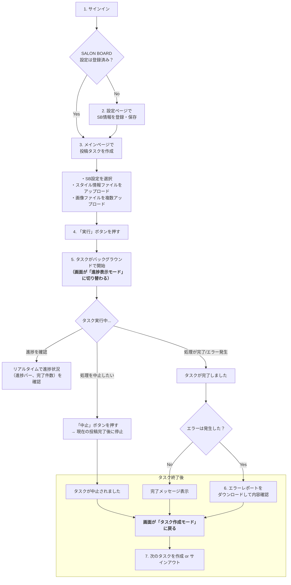

## **SALON BOARDスタイル自動投稿Webアプリケーション 要件定義書**

### **1. 概要**

#### **1.1. 本システムの目的**
本システムは、美容室スタッフが日常的に行っている「SALON BOARD」へのスタイル情報の投稿作業を自動化するための、専用Webアプリケーションである。
利用者は、スタイル情報が記載されたファイルと画像ファイルを本システムにアップロードするだけで、一連の投稿プロセスをバックグラウンドで実行できる。これにより、手作業による単純作業の時間を大幅に削減し、スタッフがより創造的な業務に集中できる環境を提供することを目的とする。

#### **1.2. ターゲット利用者**
本システムは、以下の2種類の利用者を想定している。

1.  **管理者 (Admin)**: システム全体のユーザーアカウントを管理する責任者。
2.  **一般ユーザー (User)**: 管理者からアカウントを付与されたサロンスタッフ。実際にスタイル投稿の自動化機能を利用する。

#### **1.3. システムの主要な特徴**
*   **クローズドな運用**: 管理者が承認したユーザーのみが利用できる、セキュアなアカウント管理体制を敷く。一般ユーザーによる自由なアカウント登録は許可しない。
*   **モバイルファースト**: 主な利用シーンとしてスマートフォンでの操作を想定し、最適化されたUI/UXを提供する。
*   **ユーザー単位のシングルタスク実行**: 一人のユーザーは、同時に一つのタスクしか実行できない。これにより、誤操作を防ぎ、自身のタスク状況をシンプルに把握できる。ただし、他のユーザーのタスク実行は妨げない。
*   **非同期バックグラウンド処理**: スタイル投稿のような時間のかかる処理はバックグラウンドで実行されるため、ユーザーは処理完了を待つ必要はない。
*   **揮発的なタスク管理**: 過去の実行履歴は保存せず、「現在実行中のタスク」の管理に特化することで、シンプルで直感的な操作性を実現する。

---

### **2. システムの利用フロー**

#### **2.1. 一般ユーザーの標準的な利用フロー**
一般ユーザーがログインしてからスタイル投稿を完了するまでの一連の流れは以下の通りである。

#### **2.2. 管理者の利用フロー**
1.  サインインする。
2.  管理者専用の「ユーザー管理」画面にアクセスする。
3.  必要に応じて、一般ユーザーのアカウントを「作成」「編集（パスワードリセット）」「削除」する。
4.  サインアウトする。

---

### **3. アクター（利用者）の役割と権限**

| アクター | 役割 | 主要な権限 |
| :--- | :--- | :--- |
| **管理者 (Admin)** | システムの全ユーザーアカウントを管理する。 | ・全ユーザーの情報を閲覧できる。 ・一般ユーザーのアカウントを作成、編集、削除できる。 ・（一般ユーザーが持つ全ての権限も行使可能） |
| **一般ユーザー (User)** | スタイル投稿の自動化機能を利用するサロンスタッフ。 | ・自身のSALON BOARD設定を登録、編集、削除できる。 ・自身のスタイル投稿タスクを作成し、実行できる。 ・自身の実行中タスクの進捗を確認し、中止できる。 ・他のユーザーの情報は一切閲覧・操作できない。 |

---

### **4. 機能要件**

#### **FR-1: ユーザーアカウント管理機能（管理者向け）**
管理者が一般ユーザーのアカウントを管理するための機能。

*   **FR-1.1: ユーザー一覧表示**: システムに登録されている全ユーザーの一覧（ログインID、役割など）を表示する。
*   **FR-1.2: ユーザー作成**: 新規の一般ユーザーアカウントを作成する機能。作成時に「ログインID（メールアドレス形式）」と「初期パスワード」を設定する。
*   **FR-1.3: ユーザー編集**: 既存ユーザーのパスワードをリセットする機能。
*   **FR-1.4: ユーザー削除**: 既存のユーザーアカウントを完全に削除する機能。削除時、そのユーザーに関連するデータ（SALON BOARD設定など）もすべて同時に削除される。
*   **FR-1.5: 初回管理者アカウント作成**: システム導入後、最初の管理者アカウントは、サーバー上で特定のコマンドを実行することによって作成される。これにより、セキュアな初期セットアップを担保する。

#### **FR-2: 認証機能**
全利用者がシステムを安全に利用するための機能。

*   **FR-2.1: サインイン**: 利用者は、配布されたログインIDとパスワードを用いてシステムにサインインする。
*   **FR-2.2: サインアウト**: サインイン中の利用者は、任意のタイミングで安全にサインアウトできる。
*   **FR-2.3: アクセス制御**: サインインしていない利用者は、サインインページ以外のページにはアクセスできない。一般ユーザーは、管理者専用ページにアクセスすることはできない。

#### **FR-3: SALON BOARD設定管理機能（一般ユーザー向け）**
利用者が自身のSALON BOARDアカウント情報を安全に管理するための機能。

*   **FR-3.1: 設定の登録と更新**: 利用者は、自身のSALON BOARDアカウント情報をシステムに登録・更新できる。登録項目は以下の通り。
    *   `設定名`: 複数の設定を識別するための名前（例: A店, B店）
    *   `SALON BOARD ログインID`
    *   `SALON BOARD パスワード`
    *   `対象サロンID` （任意入力）
    *   `対象サロン名` （任意入力）
*   **FR-3.2: 複数設定の管理**: 利用者は、複数のSALON BOARD設定を登録し、タスク実行時に使用する設定を選択できる。
*   **FR-3.3: パスワードの暗号化**: データベースに保存されるSALON BOARDのパスワードは、必ず強力な暗号化方式を用いて暗号化される。

#### **FR-4: スタイル投稿タスク実行機能（一般ユーザー向け）**
本システムの中心となる、スタイル投稿を自動化する機能。

*   **FR-4.1: タスク作成とファイルアップロード**: 利用者は、メインページから新規投稿タスクを作成できる。
    *   **設定選択**: 登録済みのSALON BOARD設定の中から、今回使用するものをプルダウンメニューで選択する。
    *   **ファイルアップロード**:
        *   スタイル情報ファイル（CSVまたはExcel形式）を1つアップロードする。
        *   投稿に使用する画像ファイル（JPEG, PNG形式）を複数まとめてアップロードする。
*   **FR-4.2: 実行前バリデーション**: 「実行」ボタンを押すと、システムはファイル間の整合性を検証する。スタイル情報ファイルに記載されている画像ファイル名が、アップロードされた画像ファイルの中にすべて存在するかを確認し、不足がある場合はエラーメッセージを表示して実行を中止する。
*   **FR-4.3: 非同期バックグラウンド実行**: バリデーションが成功すると、投稿処理はバックグラウンドタスクとして実行される。利用者は処理の完了を待つ必要はなく、ブラウザを閉じてもサーバー側で処理は継続される。
*   **FR-4.4: ユーザー単位の同時実行制限**:
    *   あるユーザーがタスクを実行中の場合、そのユーザーは新しいタスクを作成・実行することはできない。
    *   タスク実行中のユーザーが再度タスクを実行しようとした場合、UI上で操作が制限される（後述の `FR-6` を参照）。
*   **FR-4.5: タスクの中止**:
    *   タスク実行中に「中止」ボタンを押すことができる。
    *   中止ボタンが押されると、現在処理中のスタイル投稿が完了したタイミングで、後続の処理を行わずにタスク全体を安全に停止する（**安全中止**）。

#### **FR-5: エラーハンドリングと報告機能**
タスク実行中に問題が発生した場合の挙動と、利用者へのフィードバックに関する機能。

*   **FR-5.1: エラー発生時の処理継続**: ある1件のスタイル投稿処理でエラーが発生した場合でも、タスク全体は停止しない。エラーが発生したスタイルはスキップされ、その情報はログに記録された後、次のスタイルの処理が自動的に続行される。
*   **FR-5.2: エラーレポートの提供**: タスクが完了（または中止）した後、1件でもエラーが発生していた場合、利用者はエラーレポートをダウンロードできる。レポートには以下の情報が含まれ、利用者が原因を容易に特定できるようにする。
    *   **エラー対象**: どのスタイル（例: スタイル名やCSVの行番号）で問題が起きたか。
    *   **エラー箇所**: どの項目（例: クーポン名、スタイリスト名）の処理で問題が起きたか。
    *   **エラー原因**: なぜエラーになったかの具体的な理由（例: 「指定されたクーポン名が見つかりませんでした」）。
    *   **スクリーンショット**: エラー発生時点のブラウザ画面の画像。

---

### **5. データ要件**

#### **5.1. 入力データ: スタイル情報ファイル（CSV/Excel）**
利用者がアップロードするファイル。以下のカラムを必須とする。カラムの順序は不問。

| カラム名 | データ型 | 説明 | 例 |
| :--- | :--- | :--- | :--- |
| `スタイリスト名` | 文字列 | 投稿するスタイリストのフルネーム。SALON BOARDに登録されている名前と完全一致する必要がある。 | `山田 太郎` |
| `クーポン名` | 文字列 | 紐付けるクーポンの名称。SALON BOARDに登録されている名前と完全一致する必要がある。 | `【新規様限定】カット＋カラー` |
| `コメント` | 文字列 | スタイルの説明文。 | `ナチュラルな質感がポイントです。` |
| `スタイル名` | 文字列 | 投稿するスタイルの名前。 | `大人かわいいゆるふわボブ` |
| `カテゴリ` | 文字列 | `レディース` または `メンズ` のいずれか。 | `レディース` |
| `長さ` | 文字列 | カテゴリに応じた髪の長さ。 | `ミディアム` |
| `メニュー内容`| 文字列 | スタイルに関連する施術内容を説明するテキスト。 | `カット＋トリートメント` |
| `ハッシュタグ` | 文字列 | 複数のハッシュタグをカンマ（`,`）区切りで指定。 | `ゆるふわ,ボブ,20代` |
| `画像名` | 文字列 | 同時にアップロードする画像ファイル名（拡張子を含む）。 | `style01.jpg` |

#### **5.2. 画像データ**
*   **形式**: `JPEG`, `PNG`
*   **ファイル名**: スタイル情報ファイルの `画像名` カラムに記載された名前と一致している必要がある。

---

### **6. 画面とUI/UX要件**

#### **FR-6: UI/UXに関する要件**
利用者が直感的かつ快適に操作できるためのインターフェースに関する要件。

*   **FR-6.1: モバイルファースト設計**: 全ての画面は、スマートフォンの画面サイズとタッチ操作を最優先して設計される。PCでの表示も崩れないレスポンシブデザインとする。
*   **FR-6.2: タスク実行中のUI挙動**:
    *   ユーザーがタスクを正常に開始すると、メインページの画面は「**進捗表示モード**」に切り替わる。
    *   このモードでは、新しいタスクを作成するためのフォーム（設定選択、ファイルアップロード、実行ボタンなど）は**完全に非表示**になる。
    *   画面には、タスクの進捗状況（完了件数、総件数、進捗バーなど）と「中止」ボタンのみが大きく表示される。
*   **FR-6.3: タスク完了後のUI挙動**:
    *   タスクが「完了」「エラー」「中止」のいずれかで終了すると、画面は自動的に元の「**タスク作成モード**」に戻る。
    *   利用者は、特別な操作をすることなく、すぐに次の新しいタスクの作成に取り掛かることができる。
    *   エラーが発生した場合は、タスク作成フォームの上部などに、エラーレポートのダウンロードリンクが提示される。

---

### **7. スコープ（対象範囲）**

#### **7.1. 範囲内 (In-Scope)**
本要件定義書で `FR-1` から `FR-6` に定義されたすべての機能。

*   管理者によるユーザーアカウント管理
*   認証機能
*   SALON BOARD設定の管理機能
*   スタイル投稿タスクの作成、実行、中止機能（ユーザー単位のシングルタスク）
*   エラー発生時の処理継続と、詳細なエラーレポートの提供
*   モバイルファーストなUIと、タスク実行状態に応じた明確な画面切り替え

#### **7.2. 範囲外 (Out-of-Scope)**
本プロジェクトの対象外となる機能。

*   **一般ユーザーによるセルフサインアップ（アカウント登録）機能**
*   **タスク履歴の保存・閲覧機能**
*   **タスクの中断・再開機能**
*   **システム全体で同時に複数ユーザーがタスクを実行する機能の厳密な性能保証**（ユーザー単位の制限は実装するが、多数のユーザーが同時に実行した場合の負荷テストは範囲外）
*   スタイル以外の情報（ブログ、クーポン、お知らせ等）の自動投稿機能
*   アプリ上でのスタイル情報ファイル（CSV/Excel）の編集機能
*   外部サービス（メール、Slack等）へのタスク完了・エラー通知機能
*   投稿済みスタイルの編集・削除機能